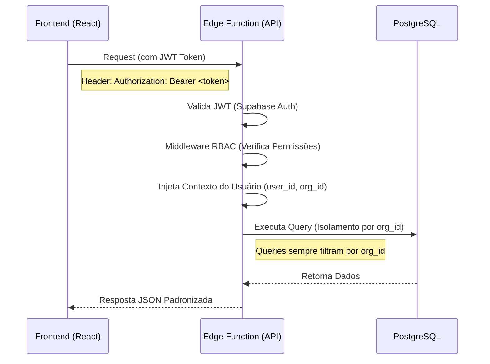

# Arquitetura do Sistema COMPIA

Este documento detalha a arquitetura técnica do sistema COMPIA, uma plataforma B2B SaaS Multi-tenant para Inspeções de Segurança do Trabalho.

## 1. Visão Geral do Sistema

O sistema segue uma arquitetura moderna **Serverless**, utilizando o Supabase como Backend-as-a-Service (BaaS) e Edge Functions para regras de negócio complexas.

### Diagrama de Sistemas

```mermaid
graph TD
    User[Usuário / Cliente] -->|HTTPS| Frontend[Frontend React (Vite/Vercel)]
    
    subgraph "Camada de Aplicação (Supabase Edge)"
        Frontend -->|REST API| EdgeGateway[API Gateway (Hono.js)]
        EdgeGateway -->|Auth| RBAC[Middleware RBAC]
        RBAC -->|Rota Segura| Services[Serviços de Negócio]
        Services -->|Integração| OpenAI[OpenAI API (GPT-4o / Whisper)]
    end
    
    subgraph "Camada de Dados (Supabase PaaS)"
        Services -->|Query| DB[(PostgreSQL)]
        Services -->|Upload/Download| Storage[Supabase Storage]
        Frontend -->|Auth Token| Auth[Supabase Auth]
    end

    style Frontend fill:#e1f5fe,stroke:#01579b
    style EdgeGateway fill:#fff3e0,stroke:#ff6f00
    style DB fill:#e8f5e9,stroke:#2e7d32
```

## 2. Fluxo de Dados

O fluxo de dados segue um padrão estrito para garantir segurança e isolamento entre tenants (empresas).



## 3. Estrutura do Backend (Supabase)

O Backend é dividido estritamente entre Definição de Dados (Schema) e Lógica de Negócio (Functions).

### `supabase/migrations` (Schema)
Contém o código SQL declarativo que define a estrutura do banco de dados.
- Tabelas, Views, Índices.
- Triggers e RPCs (Stored Procedures) para lógica puramente de banco.
- Políticas RLS (Row Level Security) que atuam como última linha de defesa.

### `supabase/functions` (Lógica)
Contém a lógica de aplicação escrita em **TypeScript** rodando em Deno.
- **`api/index.ts`**: Ponto de entrada único. Utilizamos o framework **Hono** para roteamento dentro de uma única Edge Function monolítica para performance e compartilhamento de código.
- **`api/*-routes.ts`**: Controladores que definem as rotas (ex: `inspection-routes.ts`).
- **`api/rbac-middleware.ts`**: Middleware central que intercepta todas as requisições para garantir que o usuário tem permissão para a ação solicitada.

## 4. Tecnologias Principais

| Camada | Tecnologia | Função Principal |
|--------|------------|------------------|
| **Frontend** | React 18, Vite, TailwindCSS | Interface do usuário e estado local |
| **Linguagem** | TypeScript | Tipagem estática em todo o stack (Fullstack Type Safety) |
| **API Runtime** | Deno (Supabase Edge Functions) | Execução de código backend serverless |
| **API Framework** | Hono | Roteamento rápido e leve para Edge |
| **Database** | PostgreSQL | Armazenamento relacional robusto |
| **AI** | OpenAI (GPT-4o, Whisper) | Inteligência para análise de inspeções e transcrição |
