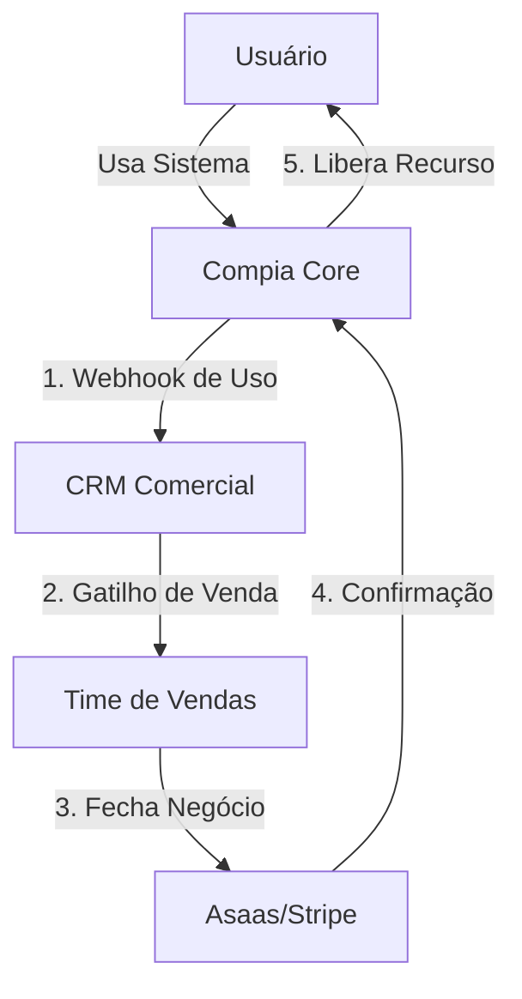

# Integração Nativa Financeiro ↔ CRM (Motor de Receita)

> **Status:** Documento Fundamental (Bíblia Comercial)
> **Objetivo:** Garantir que o módulo financeiro nasça integrado ao CRM
> **Princípio:** O uso do produto alimenta automaticamente o processo de vendas.

---

## 1. Arquitetura de Integração (Day 1)

O sistema financeiro não será isolado. Desde o primeiro dia, ele deve emitir eventos para o CRM.

### 1.1 Fluxo de Dados



---

## 2. Entidades Financeiras Obrigatórias (Schema DB)

As tabelas financeiras devem ter campos de ligação com o CRM.

### 2.1 Tabela `organizations` (Existente - Atualizar)

Adicionar campos de rastreamento comercial:
- `crm_deal_id` (ID do contrato no CRM)
- `crm_status` (Trial, Active, Churn, Risk)
- `account_manager_id` (Quem cuida dessa conta)

### 2.2 Tabela `subscriptions` (Nova)

- `plan_id`
- `billing_cycle` (monthly/annual)
- `next_billing_date`
- `mrr_value_cents` (valor para relatório financeiro)
- `usage_limits` (snapshot dos limites contratados)

### 2.3 Tabela `usage_metrics` (Nova - Alimentação do CRM)

Tabela agregadora diária para enviar ao CRM:
- `org_id`
- `date`
- `active_users_count`
- `inspections_count`
- `ai_analyses_count`
- `storage_used_mb`

---

## 3. Webhooks Obrigatórios (Core → CRM)

O Compia deve disparar esses webhooks nativamente:

### 3.1 Gatilhos de Crescimento (Upsell)

| Evento | Condição | Ação no CRM |
|--------|----------|-------------|
| `usage.limit_warning` | Uso > 80% do plano | Criar Oportunidade "Upsell de Plano" |
| `feature.blocked` | Usuário tentou usar feature bloqueada | Criar Tarefa "Contato Ativo - Interesse em Feature X" |
| `user.invited_many` | Adicionou +3 usuários em 1 dia | Notificar CS "Expansão Rápida" |

### 3.2 Gatilhos de Risco (Churn)

| Evento | Condição | Ação no CRM |
|--------|----------|-------------|
| `activity.drop` | Sem login admin por 7 dias | Criar Tarefa "Risco de Churn - Contato Urgente" |
| `payment.failed` | Pagamento falhou no gateway | Mudar status "Inadimplente", alertar Financeiro |

---

## 4. Integração Financeira (Billing)

### 4.1 Ciclo de Cobrança

1. CRM define o contrato (Plano, Valor, Data)
2. CRM envia para Compia Core via API: `POST /api/internal/subscription/create`
3. Compia Core cria a `subscription` e conecta ao Gateway
4. Gateway gerencia a cobrança recorrente

---

## 5. Implementação Técnica (Fase 1)

Para o módulo financeiro nascer integrado, precisamos:

1. **Migrations:** criar tabelas `subscriptions` e `usage_metrics`.
2. **Edge Function:** `crm-sync` (job diário que agrega métricas e envia ao CRM).
3. **Webhook Emitter:** funcão utilitária no backend para disparar eventos críticos em tempo real.

### Exemplo de Payload para CRM

```json
{
  "event": "usage.limit_warning",
  "org_id": "uuid-1234",
  "metric": "ai_analyses",
  "current_usage": 95,
  "limit": 100,
  "timestamp": "2026-01-22T10:00:00Z"
}
```

---

## 6. Conclusão

Não vamos construir um sistema de cobrança isolado. Vamos construir um **sistema de inteligência de receita** onde o módulo financeiro é apenas a parte que processa o pagamento, mas a inteligência fica na conexão Compia <-> CRM.
