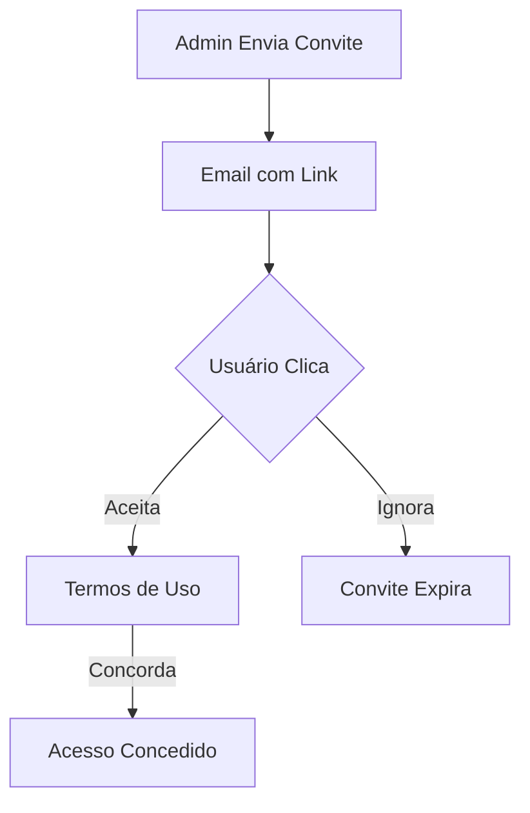

# Conformidade LGPD e ISO 27001 - Sistema de Convites

**Documento:** Análise de Conformidade  
**Versão:** 1.0  
**Data:** 2026-02-05  
**Classificação:** Confidencial

---

## 1. Dados Pessoais Coletados

| Dado | Finalidade | Base Legal (LGPD) |
|------|------------|-------------------|
| Email | Identificação e comunicação | Consentimento (Art. 7º, I) |
| Nome (via JWT) | Personalização | Execução de contrato (Art. 7º, V) |
| IP/User-Agent | Segurança e auditoria | Legítimo interesse (Art. 7º, IX) |

---

## 2. Controles ISO 27001

### A.9.2.1 - Registro e Cancelamento de Usuário

| Requisito | Implementação |
|-----------|---------------|
| Processo formal de registro | ✅ Convite + Aceitação |
| Identificador único | ✅ UUID no banco |
| Cancelamento de acesso | ✅ Revogação de convite / Desativação |

### A.9.2.2 - Provisionamento de Acesso

| Requisito | Implementação |
|-----------|---------------|
| Autorização do proprietário | ✅ OrgAdmin envia convite |
| Verificação de nível de acesso | ✅ Role atribuído no convite |
| Registro de acesso concedido | ✅ `created_at`, `created_by` |

### A.9.4.1 - Restrição de Acesso à Informação

| Requisito | Implementação |
|-----------|---------------|
| RLS por organização | ✅ Policies no PostgreSQL |
| Token nunca exposto | ✅ SECURITY DEFINER function |
| Expiração automática | ✅ 7 dias |

---

## 3. Direitos do Titular (LGPD)

### Direito de Acesso (Art. 18, II)
- Usuário pode ver suas organizações em **Configurações → Perfil**

### Direito de Exclusão (Art. 18, VI)
- Convites pendentes podem ser revogados
- Usuários podem solicitar desativação de conta

### Direito de Portabilidade (Art. 18, V)
- Dados exportáveis via **Configurações → Exportar Dados**

---

## 4. Medidas Técnicas de Segurança

### Criptografia
- ✅ HTTPS em todas as comunicações
- ✅ Tokens gerados com `crypto.randomUUID()` (128-bit)
- ✅ Senhas (se aplicável) com bcrypt

### Auditoria
- ✅ Todas ações registradas com timestamp e autor
- ✅ Logs retidos por 90 dias

### Minimização de Dados
- ✅ Apenas email coletado no convite
- ✅ Dados adicionais apenas após aceite

---

## 5. Fluxo de Consentimento

---

## 6. Retenção de Dados

| Tipo | Período | Justificativa |
|------|---------|---------------|
| Convites aceitos | Indefinido | Auditoria de acesso |
| Convites expirados | 90 dias | Compliance |
| Convites revogados | 90 dias | Auditoria |

Após período: Anonimização ou exclusão.

---

## 7. Incidentes

### Procedimento
1. **Detecção:** Monitoramento de acessos anômalos
2. **Contenção:** Revogação massiva de convites se necessário
3. **Notificação:** ANPD em 72h se vazamento de dados pessoais
4. **Correção:** Patch e nova validação de segurança

---

## 8. Responsabilidades

| Papel | Responsabilidade |
|-------|------------------|
| OrgAdmin | Gerenciar convites da sua organização |
| SysAdmin | Auditoria global e suporte |
| DPO | Garantir conformidade LGPD |
| Desenvolvimento | Implementar controles técnicos |

---

## 9. Referências

- **LGPD:** Lei 13.709/2018
- **ISO 27001:2022:** Anexo A - Controles
- **OWASP:** Access Control Cheat Sheet
