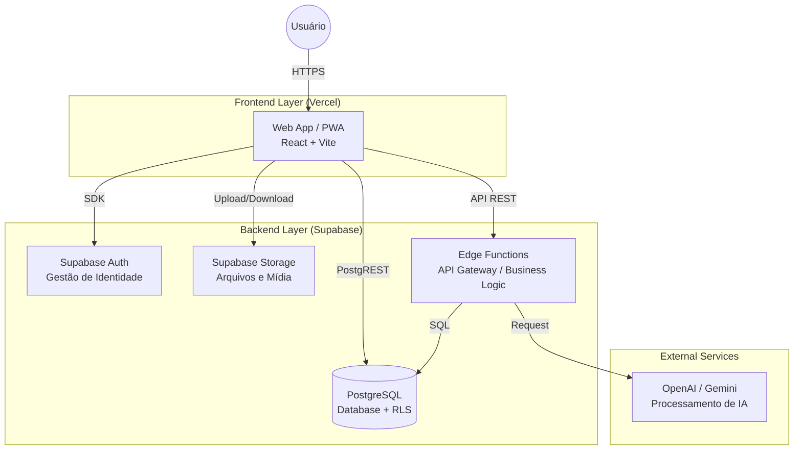

# Visão Geral da Arquitetura - COMPIA Enterprise

> **Versão:** 1.0
> **Data:** 04/02/2026
> **Responsável:** Equipe de Engenharia COMPIA

---

## 1. Contexto do Sistema (C4 Level 1)

## 1. Contexto do Sistema (C4 Level 1)

O **COMPIA Enterprise** é uma plataforma SaaS (Software as a Service) B2B de **Inteligência Operacional para Auditorias e Inspeções Digitais**. O sistema é agnóstico ao setor, atendendo desde Segurança do Trabalho (SST) e Agronegócio até Gestão de Qualidade (ISO) e Manutenção Predial.

### Principais Atores
*   **Auditor/Inspetor Técnico (O Herói):** Profissional de campo (Técnico de Segurança, Agrônomo, Auditor de Qualidade ou Manutenção) que realiza vistorias, coleta evidências e valida conformidades.
*   **Gestor da Operação:** Gerencia múltiplos clientes/unidades, define padrões de qualidade (Checklists) e acompanha KPIs de performance.
*   **Cliente Final:** Recebe relatórios técnicos padronizados e acompanha a resolução de não-conformidades.

---

## 2. Arquitetura de Containers (C4 Level 2)

O sistema segue uma arquitetura moderna **Serverless** e **Cloud-Native**, desacoplada entre Frontend e Backend.

### 2.1 Frontend (Aplicação Web)
*   **Tecnologia:** React 18 (TypeScript), Vite, TailwindCSS.
*   **Tipo:** Single Page Application (SPA) com capacidades de Progressive Web App (PWA).
*   **Hospedagem:** Vercel (CDN Global).
*   **Principais Bibliotecas:**
    *   `react-router-dom`: Navegação.
    *   `@tanstack/react-query`: Gestão de estado assíncrono e cache.
    *   `zustand`: Gerenciamento de estado global.
    *   `shadcn/ui` + `lucide-react`: Componentes de UI e ícones.
    *   `dexie` (IndexedDB): Armazenamento local para **Modo Offline**.

### 2.2 Backend (BaaS - Backend as a Service)
Todo o backend é sustentado pelo ecossistema **Supabase**.

#### A. Banco de Dados (PostgreSQL)
*   Persistência principal de dados.
*   **Segurança:** Uso extensivo de **RLS (Row Level Security)**. O frontend nunca acessa dados que não tem permissão explícita.
*   **Extensões:** `postgis` (Geolocalização), `pg_cron` (Tarefas agendadas).

#### B. API Layer (Edge Functions)
*   **Runtime:** Deno.
*   **Framework:** Hono (Framework leve para borda).
*   **Função:** Centralizar regras de negócio complexas que não cabem no banco de dados, como:
    *   Processamento de IA.
    *   Geração de Relatórios PDF complexos.
    *   Integrações externas (Webhooks).
    *   Rotinas de administração de usuários.

#### C. Autenticação e Autorização
*   **Supabase Auth:** Gerencia Sign-in, Sign-up, Recuperação de senha e Sessões (JWT).
*   **Roles:** As permissões são gerenciadas via Custom Claims ou tabelas de perfis (`public.profiles`) integradas às políticas RLS.

#### D. Storage
*   Buckets privados e públicos para armazenar:
    *   Evidências de inspeção (fotos/vídeos).
    *   Relatórios gerados (PDF).
    *   Assets da organização (Logos).

---

## 3. Fluxos de Dados Críticos

### 3.1 Sincronização Offline (Inspeção)
1.  Inspetor baixa dados (Checklist, Unidades) para o dispositivo (IndexedDB).
2.  Inspeção é realizada sem internet; dados salvos localmente.
3.  Ao retomar conexão, um `Service Worker` ou gancho de sincronização envia o payload para a API/Banco.

### 3.2 Geração de Relatório com IA
1.  Usuário solicita relatório final.
2.  Frontend chama Edge Function `generate-report`.
3.  Function busca dados brutos no DB.
4.  Function envia notas e evidências para LLM (ex: GPT-4o ou Gemini).
5.  IA processa análise e retorna texto formatado.
6.  Function gera PDF e salva no Storage.
7.  Link de download é retornado ao usuário.

---

## 4. Infraestrutura e Deploy

*   **Versionamento:** GitHub (Monorepo ou Repo único).
*   **CI/CD:**
    *   **Frontend:** Vercel (Build automático a cada push na `main`).
    *   **Backend:** GitHub Actions para deploy de Migrations e Edge Functions via Supabase CLI.

---

## 5. Segurança

*   **Dados em Repouso:** Criptografia padrão do PostgreSQL.
*   **Dados em Trânsito:** TLS 1.2+ em todas as comunicações.
*   **Acesso:** Tokens JWT de curta duração + Refresh Tokens.
*   **Proteção de API:** Rate Limiting configurado nas Edge Functions.
