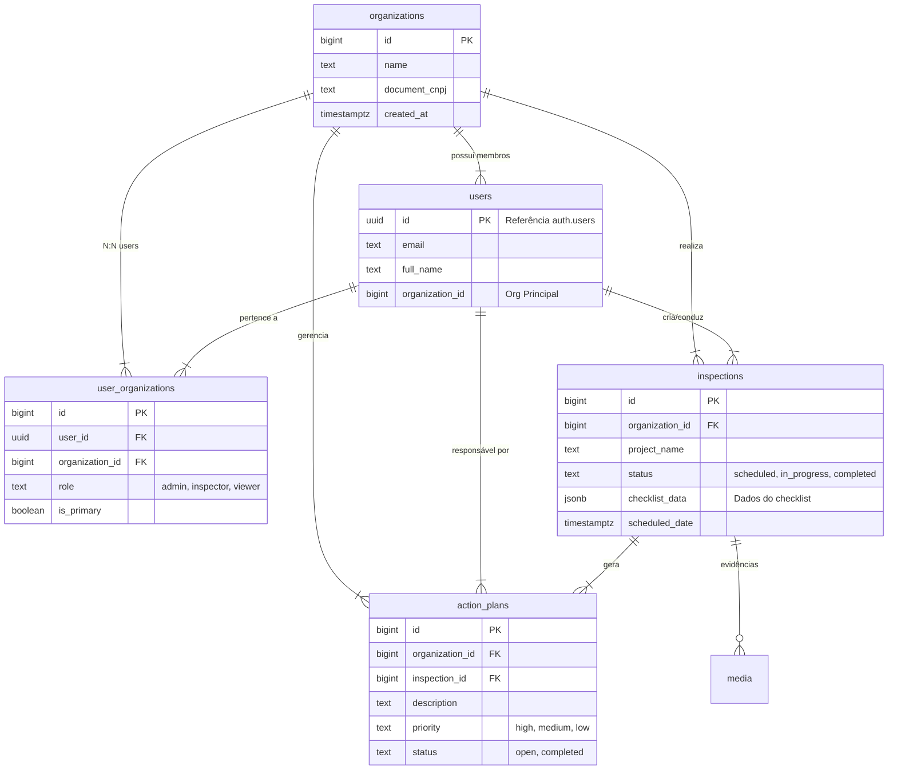

# Schema do Banco de Dados - COMPIA Enterprise

> **Versão:** 1.0 (Reflete migrações até 04/02/2026)
> **Banco:** PostgreSQL (Supabase)

---

## 1. Diagrama de Entidade-Relacionamento (ERD)

Visão simplificada das tabelas principais do núcleo do sistema.



---

## 2. Detalhamento das Tabelas

### 2.1 Núcleo (Core)

#### `organizations`
Representa as empresas clientes (SaaS Tenants).
*   **Relacionamentos:** Pai de todas as entidades de negócio.

#### `users`
Tabela pública que espelha dados não sensíveis de `auth.users`.
*   **Importante:** Usada para JOINs de exibição de nome/avatar.

#### `user_organizations`
Tabela pivô para relacionamento N:N entre Usuários e Organizações.
*   **Colunas Chave:**
    *   `role`: Papel do usuário naquela organização específica (`org_admin`, `inspector`, etc).
    *   `is_primary`: Define qual organização abre por padrão no login.

### 2.2 Operacional

#### `inspections`
Tabela central de operações. Armazena tanto o cabeçalho da inspeção quanto os dados preenchidos (JSONB).
*   **Estrutura Híbrida:**
    *   Campos relacionais para buscas rápidas (`status`, `date`, `inspector_id`).
    *   Campo `checklist_data` (JSONB) para flexibilidade dos itens do checklist, permitindo updates de template sem migração de schema ("NoSQL inside SQL").
*   **Particionamento:** Preparada para particionamento futuro por `organization_id` ou `date`.

#### `action_plans`
Planos de ação corretiva gerados a partir de não-conformidades.
*   Pode ser vinculado a uma inspeção (`inspection_id`) ou avulso.
*   Fluxo de status independente (`open` -> `in_progress` -> `completed`).

#### `media`
Registro de metadados de arquivos (fotos, vídeos, áudios).
*   Armazena URL do Storage, Geolocalização (`lat`, `long`) e Timestamp original.

---

## 3. Segurança (RLS - Row Level Security)

Todas as tabelas possuem RLS habilitado.
A regra de ouro é: **O usuário só vê dados da Organização à qual ele pertence.**

Exemplo de Política (Pseudocódigo):
```sql
POLICY "Ver Inspeções"
USING (
  organization_id IN (
    SELECT organization_id FROM user_organizations WHERE user_id = auth.uid()
  )
)
```

---

## 4. Módulos Adicionais

### 4.1 CRM
Tabelas: `leads`, `crm_activities`, `pipelines`.
*   Gerencia o fluxo de vendas e prospecção.

### 4.2 Financeiro
Tabelas: `invoices`, `subscriptions`, `plans`.
*   Controla faturamento SaaS e limites do plano.
